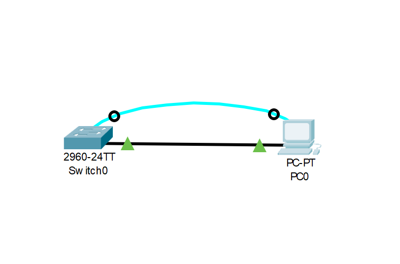

***Лабораторная работа.***
*Базовая настройка коммутатора.*

ТОПОЛОГИЯ 

Таблица адресации
Устройство    | Интерфейс    |  IP адресс \ префикс  |
------------- | -------------|-----------------------|
SW1           | VLAN1        |  192.168.1.2/24       |  
PC1           | NIC          |  192.168.1.10/24      |
------------------------------------------------------
**Задачи**

# Часть 1. Проверка конфигурации коммутатора по умолчанию
## • Шаг 1. Создаём сеть согласно топологии
## • Шаг 2. Проверяем настройки коммутатора по умолчанию.
# Часть 2. Создание сети и настройка основных параметров устройства
## •	Настройте базовые параметры коммутатора.
## •	Настройте IP-адрес для ПК.
# Часть 3. Проверка сетевых подключений.
## •	Отобразите конфигурацию устройства.
## •	Протестируйте сквозное соединение, отправив эхо-запрос.
## •	Протестируйте возможности удаленного управления с помощью Telnet.

# Часть 1. Проверка конфигурации коммутатора по умолчанию.

*Шаг 1. Создаём сеть согласно топологии.*

*a. Подключаем консольный кабель как указанно в топологии.*

*b. Устанавливаем соединение через консольный порт.*

    Почему нужно использовать консольное подключение для первоначальной настройки коммутатора? 
    - В коммутаторе установлены первоначальные заводские настройки, поэтому первоначальные настройки происходят через внеполосной кабель.
    Почему нельзя подключиться к коммутатору через Telnet или SSH? 
    - Коммутатору не присвоен IP-адрес, не разрешено подсоединение по telnet и не введен пароль на соединение.

*Шаг 2. Проверяем настройки коммутатора по умолчанию.* 

*a. Проверяем настройки коммутатора по умолчанию.*

Для этого сначала заходи в привилегированный режим.

    Switch>enable
Далее проверяем настройку коммутатора по умолчанию командой.

    Switch#show run

*b. Изучаем текущий файл running configuration.*

     Сколько интерфейсов FastEthernet имеется на коммутаторе 2960? - 24
     Сколько интерфейсов Gigabit Ethernet имеется на коммутаторе 2960? - 2
     Каков диапазон значений, отображаемых в vty-линиях? - 2 диапазона 0-4 и 5-15

*c. Изучаем файл загрузочной конфигурации (startup configuration), который содержится в энергонезависимом ОЗУ (NVRAM).*

При вводе команды появляется ответ от коммутатора.

    Switch#show startup-config 
    startup-config is not present

Данный ответ коммутатор выдаст так как изначально этого файла нет в зафодской конфигурации, он появится позже когда мы закончим настройку и скопируем running-config в startup-configuration.
    
*d.	Изучаем характеристики SVI для VLAN 1.*

Назначен ли IP-адрес сети VLAN 1? 

Изначальнов в заводской настройке не назначен, лишь только когда мы зайдем в SW(config-if) (настройка интерфейса vlan), там мы присваиваем ip адрес SVI

Какой MAC-адрес имеет SVI? 

Так как это виртуальный интерфейс то он не имеет MAC-адреса, однако его можно присвоить

Данный интерфейс включен?

Изначально выключен но после присвоения интерфесу IP-адреса его надо активировать коммандой "no shutdown"

*e.	Изучаем IP-свойства интерфейса SVI сети VLAN 1*

Какие выходные данные вы видите? 

Последовательно вводим команды:
     
    Switch#show vlan brief
    
    
    VLAN Name                             Status    Ports
    ---- -------------------------------- --------- -------------------------------
    1    default                          active    Fa0/1, Fa0/2, Fa0/3, Fa0/4
                                                Fa0/5, Fa0/6, Fa0/7, Fa0/8
                                                Fa0/9, Fa0/10, Fa0/11, Fa0/12
                                                Fa0/13, Fa0/14, Fa0/15, Fa0/16
                                                Fa0/17, Fa0/18, Fa0/19, Fa0/20
                                                Fa0/21, Fa0/22, Fa0/23, Fa0/24
                                                Gig0/1, Gig0/2
    1002 fddi-default                     active    
    1003 token-ring-default               active    
    1004 fddinet-default                  active    
    1005 trnet-default                    active 
    
    Switch#show ip interface brief

    Interface              IP-Address      OK? Method Status                Protocol 
    FastEthernet0/1        unassigned      YES manual down                  down 
    FastEthernet0/2        unassigned      YES manual down                  down 
    FastEthernet0/3        unassigned      YES manual down                  down 
    FastEthernet0/4        unassigned      YES manual down                  down 
    FastEthernet0/5        unassigned      YES manual down                  down 
    FastEthernet0/6        unassigned      YES manual down                  down 
    FastEthernet0/7        unassigned      YES manual down                  down 
    FastEthernet0/8        unassigned      YES manual down                  down 
    FastEthernet0/9        unassigned      YES manual down                  down 
    FastEthernet0/10       unassigned      YES manual down                  down 
    FastEthernet0/11       unassigned      YES manual down                  down 
    FastEthernet0/12       unassigned      YES manual down                  down 
    FastEthernet0/13       unassigned      YES manual down                  down 
    FastEthernet0/14       unassigned      YES manual down                  down 
    FastEthernet0/15       unassigned      YES manual down                  down 
    FastEthernet0/16       unassigned      YES manual down                  down 
    FastEthernet0/17       unassigned      YES manual down                  down 
    FastEthernet0/18       unassigned      YES manual down                  down 
    FastEthernet0/19       unassigned      YES manual down                  down 
    FastEthernet0/20       unassigned      YES manual down                  down 
    FastEthernet0/21       unassigned      YES manual down                  down 
    FastEthernet0/22       unassigned      YES manual down                  down 
    FastEthernet0/23       unassigned      YES manual down                  down 
    FastEthernet0/24       unassigned      YES manual down                  down 
    GigabitEthernet0/1     unassigned      YES manual down                  down 
    GigabitEthernet0/2     unassigned      YES manual down                  down 
    Vlan1                  unassigned      YES manual administratively down down
    
От сюда мы видим, что все порты находятся в состоянии "down", а vlan1 административно отключен.

*f.Подсоединим кабель Ethernet компьютера PC-A к порту 1 на коммутаторе и изучим IP-свойства интерфейса SVI сети VLAN 1. Дождемся согласования параметров скорости и дуплекса между коммутатором и ПК.*

Какие выходные данные вы видите? 

Вводим команду:

    Switch#show ip interface brief

    Interface              IP-Address      OK? Method Status                Protocol 
    FastEthernet0/1        unassigned      YES manual down                  down 
    FastEthernet0/2        unassigned      YES manual down                  down 
    FastEthernet0/3        unassigned      YES manual down                  down 
    FastEthernet0/4        unassigned      YES manual down                  down 
    FastEthernet0/5        unassigned      YES manual down                  down 
    FastEthernet0/6        unassigned      YES manual up                    up 
    FastEthernet0/7        unassigned      YES manual down                  down 
    FastEthernet0/8        unassigned      YES manual down                  down 
    FastEthernet0/9        unassigned      YES manual down                  down 
    FastEthernet0/10       unassigned      YES manual down                  down 
    FastEthernet0/11       unassigned      YES manual down                  down 
    FastEthernet0/12       unassigned      YES manual down                  down 
    FastEthernet0/13       unassigned      YES manual down                  down 
    FastEthernet0/14       unassigned      YES manual down                  down 
    FastEthernet0/15       unassigned      YES manual down                  down 
    FastEthernet0/16       unassigned      YES manual down                  down 
    FastEthernet0/17       unassigned      YES manual down                  down 
    FastEthernet0/18       unassigned      YES manual down                  down 
    FastEthernet0/19       unassigned      YES manual down                  down 
    FastEthernet0/20       unassigned      YES manual down                  down 
    FastEthernet0/21       unassigned      YES manual down                  down 
    FastEthernet0/22       unassigned      YES manual down                  down 
    FastEthernet0/23       unassigned      YES manual down                  down 
    FastEthernet0/24       unassigned      YES manual down                  down 
    GigabitEthernet0/1     unassigned      YES manual down                  down 
    GigabitEthernet0/2     unassigned      YES manual down                  down 
    Vlan1                  unassigned      YES manual administratively down down

От сюда видим, что в 6 порт коммутатора активен, следовательно подключение между ПК правильное.

*g.	Изучим сведения о версии ОС Cisco IOS на коммутаторе.*

    Введем комманду:

        Switch#show version 

От сюда следует что версия ОС Cisco IOS - 15.0(2)SE4 
    Как называется файл образа системы?
    
    А уже файл образа системы C2960-LANBASEK9-M

*h.	Изучите свойства по умолчанию интерфейса FastEthernet, который используется компьютером PC0.*

    Введем комманды:

        Switch#show interface f0/6

От сюда мы видим, что интерфейс включен.

В случае если интерфейс выключен, проделываем следующие шаги.

Заходим в режим конфигурации, далее:
    conf t

После чего заходим в конфигурацию интерфейса командой:

    int f0/6

Далее прописываем команду

    no shutdown
    
После чего можно проверить IP-свойства и увидеть что интерфес включён.
  

*i.	Изучите флеш-память*
    
Введем комманду:

        Switch#show flash

Образу Cisco IOS присвоено имя "2960-lanbasek9-mz.150-2.SE4.bin"

# 2. Настройка базовых параметров сетевых устройств

*2.1. Настройте базовые параметры коммутатора*

*а. Настраиваем в режиме глобальной конфигурации switch*

    Switch(config)#no ip domain-lookup
    Switch(config)#hostname SW1
    SW1(config)#service password-encryption
    SW1(config)#enable secret class
    SW1(config)#banner motd # Unauthorized access is strictly prohibited. #

*b.	Назначим IP-адрес интерфейсу SVI на коммутаторе.*

    SW1(config)#interface vlan 1
    SW1(config-if)#ip address 192.168.1.2 255.255.255.0
    SW1(config-if)#no shutdown

*с. Проводим настройку консоли: ограничиваем доступ паролем и изменяем параметр чтобы консольные сообщения не прерывали комманд:*

    SW1(config-if)#no shutdown
    SW1(config-line)#password cisco
    SW1(config-line)#login
    SW1(config-line)#logging synchronous 

*d.	Настроим каналы виртуального соединения для удаленного управления (vty) через Telnet.*

    SW1(config)#line vty 0 4
    SW1(config-line)#password cisco
    SW1(config-line)#login
    SW1(config-line)#transport input telnet 

Команда login нужна для активация запроса пароля на вход в текущую ветку настройки конфигурации коммутатора

*2.2. Настройте IP-адрес на компьютере PC0*

На логической схеме нашей схемы заходим в настройки PC0 и во вкладке CONFIG прописываем STATIC\FastEternet сетевые настройки:

        IP: 192.168.1.10
        NM: 255.255.255.0

-----------------------------------------------------

# 3. Проверка сетевых подключений

Просмотрим конфигурацию коммутатора.

        Switch#show running-config 
        Building configuration...
        Current configuration : 1329 bytes
        !
        version 15.0
        no service timestamps log datetime msec
        no service timestamps debug datetime msec
        service password-encryption
        !
        hostname Switch
        !
        enable secret 5 $1$mERr$9cTjUIEqNGurQiFU.ZeCi1
        !
        spanning-tree mode pvst
        spanning-tree extend system-id
        interface FastEthernet0/1
        interface FastEthernet0/2
        interface FastEthernet0/3
        interface FastEthernet0/4
        interface FastEthernet0/5
        interface FastEthernet0/6
        interface FastEthernet0/7
        interface FastEthernet0/8
        interface FastEthernet0/9
        interface FastEthernet0/10
        interface FastEthernet0/11
        interface FastEthernet0/12
        interface FastEthernet0/13
        interface FastEthernet0/14
        interface FastEthernet0/15
        interface FastEthernet0/16
        interface FastEthernet0/17
        interface FastEthernet0/18
        interface FastEthernet0/19
        interface FastEthernet0/20
        interface FastEthernet0/21
        interface FastEthernet0/22
        interface FastEthernet0/23
        interface FastEthernet0/24
        !
        interface GigabitEthernet0/1
        interface GigabitEthernet0/2
        !
        interface Vlan1
        ip address 192.168.1.2 255.255.255.0
        !
        banner motd ^C Unauthorized access is strictly prohibited. ^C
        !
        line con 0
        password 7 0822455D0A16
        login
        !
        line vty 0 4
        password 7 0822455D0A16
        login
        transport input telnet
        line vty 5 15
        password 7 0822455D0A16
        login
        transport input telnet
        end

    
