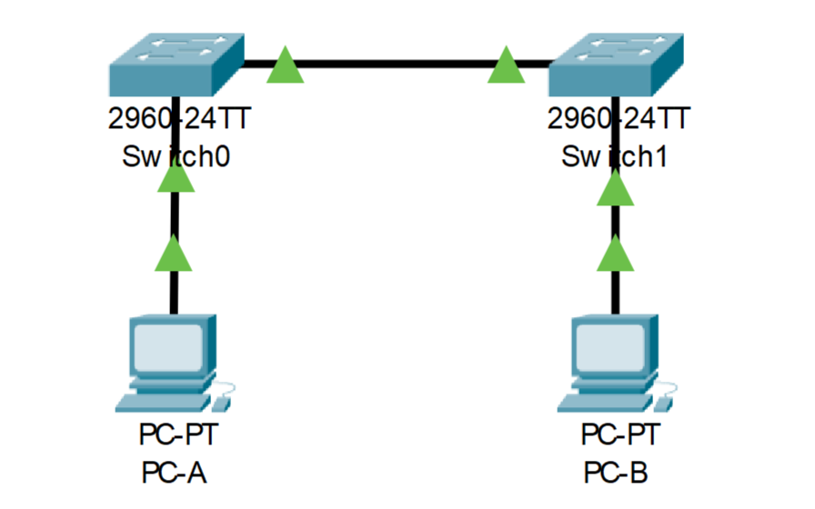

# **Лабораторная работа. Просмотр таблицы MAC-адресов коммутатора.**

*Топология*

Таблица адресации.
Устройство    | Интерфейс    |  IP адресс            |  Маска подсети  |
------------- | -------------|-----------------------|---------------  |
S1            | VLAN1        |  192.168.1.11         |  255.255.255.0  |
S2            | VLAN1        |  192.168.1.12         |  255.255.255.0  |
PC-A          | NIC          |  192.168.1.1          |  255.255.255.0  |
PC-B          | NIC          |  192.168.1.1          |  255.255.255.0  |
------------------------------------------------------------------------

**Задачи**
## Часть 1. Создание и настройка сети.
### *Шаг 1. Подключите сеть в соответствии с топологией.*
### *Шаг 2. Настройте узлы ПК.*
### *Шаг 3. Выполните инициализацию и перезагрузку коммутаторов.*
### *Шаг 4. Настройте базовые параметры каждого коммутатора.*

## Часть 2. Изучение таблицы MAC-адресов коммутатора.
### *Шаг 1. Запишим МАС-адреса сетевых устройств*
### *Шаг 2. Просмотрим таблицу МАС-адресов коммутатора.*
### *Шаг 3. Очистить таблицу МАС-адресов коммутатора S2 и снова отобразить таблицу МАС-адресов.*
### *Шаг 4. С компьютера PC-B отправить эхо-запросы устройствам в сети и просмотреть таблицу МАС-адресов коммутатора.*
------------------------------------------------------------------------
## Часть 1. Создаем сеть согласно топологии и производим базовую настройку каждого коммутатора. 
[Действуим по данной инструкции](https://github.com/Gleb02/labs_otus/blob/main/lab/lab01.md)

## Часть 2. Изучаем таблицы MAC-адрессов.
*Шаг 1. Запишем MAC-адреса сетевых устройств.*
   *a. Открываем командную строку на PC-A и PC-B и в водим команду*
   
    ipconfig /all.     

От сюда получаем что MAC-адресс PC-A *000C.CF21.EBE0*

    FastEthernet0 Connection:(default port)

    Connection-specific DNS Suffix..: 
    Physical Address................: 000C.CF21.EBE0
    Link-local IPv6 Address.........: FE80::20C:CFFF:FE21:EBE0
    IPv6 Address....................: ::
    IPv4 Address....................: 192.168.1.1
    Subnet Mask.....................: 255.255.255.0
    Default Gateway.................: ::
                                      0.0.0.0
    DHCP Servers....................: 0.0.0.0
    DHCPv6 IAID.....................: 
    DHCPv6 Client DUID..............: 00-01-00-01-84-53-E6-DB-00-0C-CF-21-EB-E0
    DNS Servers.....................: ::
                                      0.0.0.0
MAC-Адресс PC-B *0000.0C10.1945*

    FastEthernet0 Connection:(default port)

    Connection-specific DNS Suffix..: 
    Physical Address................: 0000.0C10.1945
    Link-local IPv6 Address.........: FE80::200:CFF:FE10:1945
    IPv6 Address....................: ::
    IPv4 Address....................: 192.168.1.2
    Subnet Mask.....................: 255.255.255.0
    Default Gateway.................: ::
                                      0.0.0.0
    DHCP Servers....................: 0.0.0.0
    DHCPv6 IAID.....................: 
    DHCPv6 Client DUID..............: 00-01-00-01-0E-A8-69-89-00-00-0C-10-19-45
    DNS Servers.....................: ::
                                      0.0.0.0
                                                               
*b. Узнаём MAC-адреса портов FastEthernet0/1 коммутаторов S1 и S2.*

Для этого заходи в привилегированный режим и прописываем команду

    show interface F0/1

MAC- адрес для f0/1 коммутатора S1 *0001.4276.0901*

MAC- адрес для f0/1 коммутатора S2 *0060.3e77.6001*

*Шаг 2. Посмотрим таблицу MAC-адресов коммутатора S2.*

a. Подключаемся к коммутатору и входим в привилегированный режим.

b. В привилегированном режими вводим команду

    show mac address-table

В таблице MAC-адресов содержаться 4 адреса

     Mac Address Table
    -------------------------------------------

    Vlan    Mac Address       Type        Ports
    ----    -----------       --------    -----

    1    0000.0c10.1945    DYNAMIC     Fa0/18
    1    0001.4276.0901    DYNAMIC     Fa0/1
    1    0001.9661.98e5    DYNAMIC     Fa0/1
    1    000c.cf21.ebe0    DYNAMIC     Fa0/1

*Шаг 3. Очищаем таблицу MAC-адресов коммутатора S2.*

a. В привилегированном режиме вводим команду 

    clear mac address-table dynamic 

Далее быстро вводим команду 

    show mac address-table

После очистки таблицы MAC-адресов:

В таблице остаётся один MAC-адресс коммутатора S1 так как они активно обмениваются данными друг с друмом.

*Шаг 4. С компьютера PC-B отправляем эхо-запросы устройствам в сети и просматриваем таблицу MAC-адресов коммутатора.*

a. На компьютере PC-B открываем командную строку и вводим команду 

    arp -a

Не считая адресов многоадресной и широковещательной рассылки, было получино 2 IP- и МАС-адреса устройств через протокол ARP

принадлежащие коммутаторам S1 и S2

b. Из командной строки отправляем эхо-запросы на сетевые устройства из таблицы адресации.

После чего получаем ответы от всех сетевых устройств, что говорит нам о том, что у нас нет проблем с IP-адресацией и также нет проблем с кабелем. 

с. Подключившись через консольный кабель к коммутатору S2, вводим команду

    show mac address-table 

От чего можно сделать ввывод, что коммутатор добавил в таблицу MAC-адресов, дополнительные MAC-адреса PC-A, PC-B, а также свой собственый MAC-адрес принадлежащий порту f0/1.

Так же после повторного ввода команды, на PC-B в ARP-кэше появились дополнительные записи тех сетевых устройств, которым были отправлены эхл-запросы.

    C:\>arp -a
    Internet Address      Physical Address      Type
    192.168.1.1           000c.cf21.ebe0        dynamic
    192.168.1.11          0001.9661.98e5        dynamic
    192.168.1.12          00e0.a383.2091        dynamic
